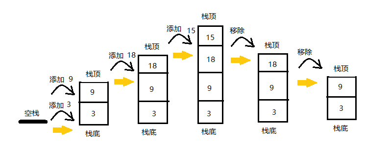

# 栈（stack）

百度百科解释为：

> 栈（stack）,又名堆栈，它是一种**运算受限的线性表**。限定仅在表尾进行插入和删除操作的线性表。这一端被称为栈顶，相对地，把另一端称为栈底。
向一个栈插入新元素又称作进栈、入栈或压栈，它是把新元素放到栈顶元素的上面，使之成为新的栈顶元素；从一个栈删除元素又称作出栈或退栈，它是把栈顶元素删除掉，使其相邻的元素成为新的栈顶元素。

更通俗的理解：
> 栈是一种遵从后进先出（LIFO）原则的有序集合。
新添加或待删除的元素都保存在栈的同一端，称作栈顶，另一端就叫栈底。在栈里，新元素都靠近栈顶，旧元素都接近栈底。
> 在现实生活中也有很多栈的例子。例如，餐厅里叠放的盘子和一摞书籍
> 
> 

## 实现栈数据结构

我们实现栈数据结构，首先我们需要把栈的元素保存，我们知道在JavaScript里面最常用的就是数组，所以我们先使用数组保存元素实现栈。由于栈遵循LIFO(先进后出)原则，我们需要对元素的插入和删除功能进行限制。
我们需要为栈定制那些方法呢？

- push(elements):添加一个或者多个新元素到栈顶
- pop():移除栈顶的元素，同时返回移除的元素
- peek():返回栈顶的元素，不对栈做修改
- isEmpty():如果栈里没有任何元素，返回true，否则返回false
- clear():移除栈里的所有元素
- size():返回栈里的元素个数

### 使用数组实现

- 我们将创建一个类来表示栈，创建一个stack_array.js文件并声明Stack类。
```javascript
class Stack{
  constructor() {
    this.item = [];//使用数组保存栈的元素
  }
}
```
- push(elements):添加一个或者多个新元素到栈顶
```javascript
push(element) {
    this.item.push(element);//往栈顶添加元素，就是给数组末尾添加元素
  }
```
- pop():移除栈顶的元素，同时返回移除的元素
```javascript
pop() {
    return this.item.pop();//移除栈顶元素，就是移除数组末尾的元素并返回
  }
```
- peek():返回栈顶的元素，不对栈做修改
```javascript
peek() {
    return this.item[this.item.length - 1];//返回栈顶的元素，就是把数组的最后一个元素返回
  }
```
- isEmpty():如果栈里没有任何元素，返回true，否则返回false
```javascript
isEmpty() {
    return this.item.length === 0;//检测栈是否为空，我们简单判断数组的长度是否为0
  }
```
- clear():移除栈里的所有元素
```javascript
clear() {
    this.item = [];//移除所有的栈元素，我们把数组赋值为一个新的数组
  }
```
- size():返回栈里的元素个数
```javascript
  size() {
    return this.item.length;//栈里的元素个数，我们返回数组的长度
  }
```
------
完整的代码如下
```javascript
class Stack{
  constructor() {
    this.item = []
  }
  // - push(elements):添加一个或者多个新元素到栈顶
  push(element) {
    this.item.push(element)
  }
  // - pop():移除栈顶的元素，同时返回移除的元素
  pop() {
    return this.item.pop()
  }
  // - peek():返回栈顶的元素，不对栈做修改
  peek() {
    return this.item[this.item.length - 1]
  }
  // - isEmpty():如果栈里没有任何元素，返回true，否则返回false
  isEmpty() {
    return this.item.length === 0
  }
  // - clear():移除栈里的所有元素
  clear() {
    this.item = []
  }
  // - size():返回栈里的元素个数
  size() {
    return this.item.length
  }
}
```
------
#### 简单使用
```javascript
const stack = new Stack()
console.log('stack.isEmpty() :>> ', stack.isEmpty());// stack.isEmpty() :>>  true
// 入栈
stack.push(3)
stack.push(9)
console.log('stack.peek() :>> ', stack.peek());// stack.peek() :>>  9
stack.push(18)
console.log('stack.size() :>> ', stack.size());// stack.size() :>>  3
console.log('stack.isEmpty() :>> ', stack.isEmpty());// stack.isEmpty() :>>  false
stack.push(15)
// 出栈
stack.pop()
stack.pop()
console.log('stack.size() :>> ', stack.size());// stack.size() :>>  2
```


### 使用对象实现

使用对象的实现方法，我们做了以下调整：
- 在构造函数中加入count属性作为标记
- 利用count属性，使我们在添加元素和获取元素始终是在栈顶(遵循LIFO原则)
- 利用count属性，我们可以快速获取栈的长度
以为实现和数组差别不是特别大，具体实现步骤这里就不一一列举了，直接上完整的代码，在代码里面使用注释说明
```javascript
class Stack{
  constructor() {
    this.item = {};
    this.count = 0;
  }
  // - push(elements):添加一个元素栈顶，这个版本只允许我们一次插入一个元素到栈顶
  push(element) {
    this.item[this.count] = element;//使用count为键，element为值存储在item中
    this.count++;//添加一个元素，表示长度的count++
  }
  // - pop():移除栈顶的元素，同时返回移除的元素
  pop() {
    if(this.isEmpty()) {
      return undefined
    }
    this.count--;//移除元素，count--
    let result = this.item[this.count];//拿到要删除的元素，改方法要返回他
    delete this.item[this.count];//使用delete删除对象的属性，这个属性就保存着要移除的元素
    return result;
  }
  // - peek():返回栈顶的元素，不对栈做修改
  peek() {
    return this.item[this.count-1];//count-1 就是栈顶元素的键
  }
  // - isEmpty():如果栈里没有任何元素，返回true，否则返回false
  isEmpty() {
    return this.count === 0;//count表示栈的长度
  }
  // - clear():移除栈里的所有元素
  clear() {
    this.item = {};//将item清空
    this.count = 0;//栈的长度归0
  }
  // - size():返回栈里的元素个数
  size() {
    return this.count;//count就是栈的长度
  }
  // - toString():为stack重写toString方法
  toString() {
    if (this.isEmpty()) {
      return '';
    }
    let objString = `${this.items[0]}`; // 以第一个值作为初始值
    for (let i = 1; i < this.count; i++) { // 迭代栈所有的键
      objString = `${objString}, ${this.items[i]}`; // 使用','拼接起来
    }
    return objString;
  }
}
```
**使用对象实现的栈和使用数组实现的栈在使用上没有任何区别**这里就不演示了

